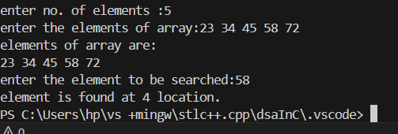

# 📰 Fake News Prediction

A machine learning model that classifies news articles as **Real** or **Fake** using Natural Language Processing and Logistic Regression.

## 📊 Results
- **Training Accuracy**: 99.14%
- **Testing Accuracy**: 98.80%
- **Model**: Logistic Regression with TF-IDF Vectorization



## 🎯 Key Features
- Text preprocessing with NLTK: stemming + stopword removal
- TF-IDF vectorization to convert text to numerical features
- Proper train/test split to prevent data leakage
- Interactive command-line prediction system
- 98.8% accuracy on unseen test data

## 🛠️ Tech Stack
- **Language**: Python 3.8+
- **Libraries**: Pandas, NumPy, NLTK, Scikit-learn
- **Algorithm**: Logistic Regression
- **Vectorizer**: TfidfVectorizer

## 📂 Dataset
Uses the [Fake and Real News Dataset](https://www.kaggle.com/datasets/clmentbisaillon/fake-and-real-news-dataset) from Kaggle. 
- 44,898 total articles
- Labels: `0 = Fake`, `1 = Real`
- Balanced dataset with title + text features

> Note: CSV files are not included in this repo due to size. Download them from Kaggle and place `True.csv` and `Fake.csv` in the project root.

## ⚙️ Installation & Usage

1. **Clone the repository**
   ```bash
   git clone https://github.com/sangeetadhankhar10/fake-news-prediction.git
   cd fake-news-prediction
2. ``` pip install -r requirements.txt ```
3. Download True.csv and Fake.csv from Kaggle and place them in the project folder.
4. Run the model 
   ``` python fakenews.py ```
5. Test it 
   Enter any text when prompted :
   Enter news text :